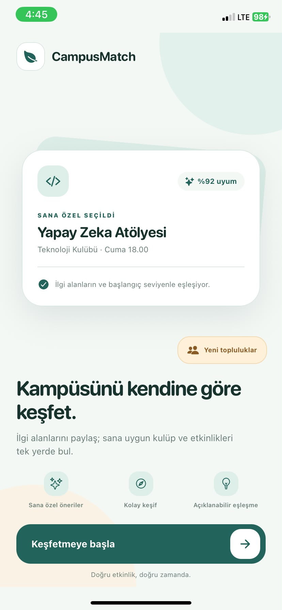
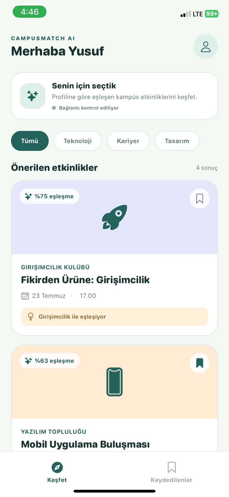
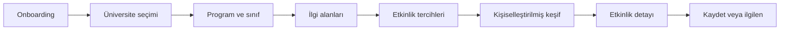
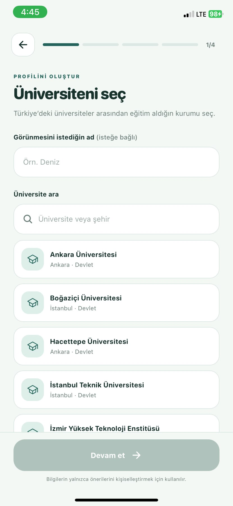
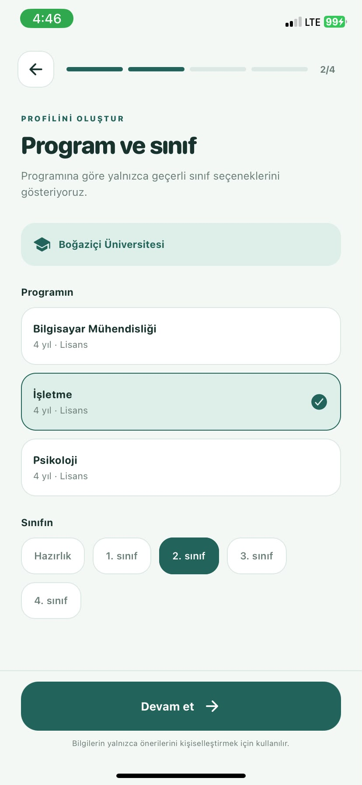
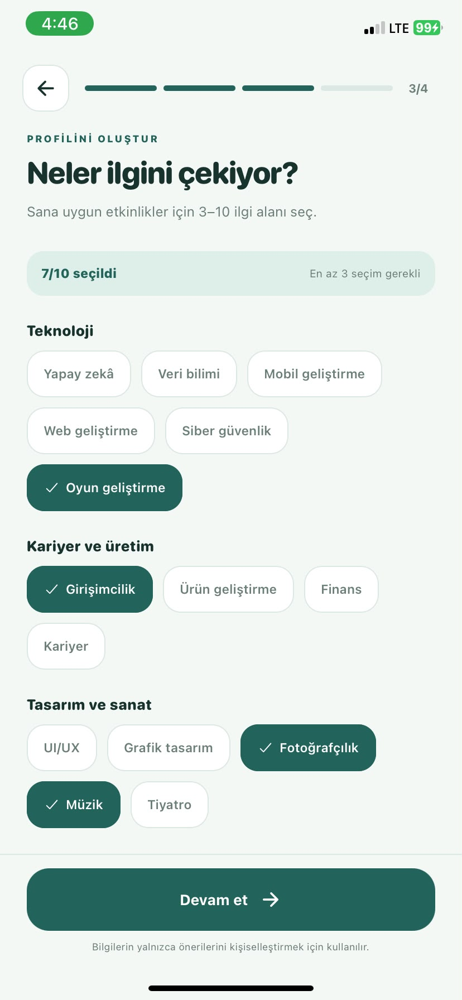
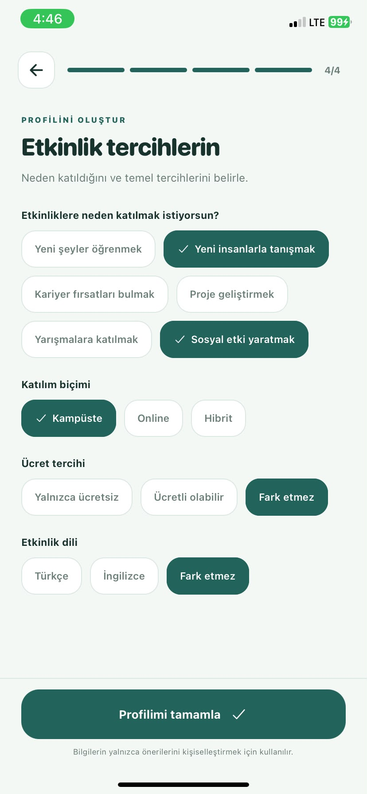

<div align="center">

# CampusMatch AI

### Doğru öğrenci, doğru kulüp ve doğru etkinlikle daha hızlı buluşsun.

**YZTA Bootcamp 2026 · Grup 132 · Mobil Öncelikli Öğrenci Etkinlik Platformu**

`Sprint 2 Tamamlandı` · `Mobil MVP Çalışıyor` · `Açıklanabilir Öneri Sistemi`

<br>


&nbsp;&nbsp;&nbsp;


</div>

---

## Proje Özeti

CampusMatch AI, Türkiye'deki üniversite öğrencilerinin ilgi alanları, programları ve etkinlik tercihleri doğrultusunda uygun kulüp ve etkinlikleri keşfetmesini sağlayan yapay zekâ destekli mobil platformdur.

| Problem | Çözüm |
|---|---|
| Etkinlik duyurularının dağınık kanallarda kaybolması | Öğrenci profiline göre tek yerde kişiselleştirilmiş keşif |
| Öğrencinin neden bir etkinlik gördüğünü bilmemesi | Açıklanabilir eşleşme skoru ve öneri nedenleri |
| Kulüplerin doğru öğrenci kitlesine ulaşamaması | İlgi, program ve davranış sinyallerine dayalı hedefleme altyapısı |

**Birincil hedef kitle:** Türkiye'deki üniversite öğrencileri<br>
**İkincil hedef kitle:** Üniversite kulüpleri ve öğrenci toplulukları<br>
**MVP odağı:** Öğrenci profili → kişiselleştirilmiş öneri → etkinlik detayı → kaydetme

<details>
<summary><strong>Ürün kapsamı ve temel özellikler</strong></summary>

- Kontrollü üniversite, program ve sınıf seçimi
- Geniş ilgi alanı ve katılım amacı seçenekleri
- Katılım biçimi, ücret ve dil tercihleri
- Kişiselleştirilmiş etkinlik sıralaması
- Eşleşme yüzdesi ve “Neden önerildi?” açıklaması
- Etkinlik detay ve kaydetme akışı
- Canlı backend önerisi ile yerel öneri arasında güvenli geçiş
- İlerleyen aşamada swipe etkileşimi ve kulüp yönetim paneli

</details>

## Takım

| İsim | Rol |
|---|---|
| Yusuf Göktepe | Scrum Master |
| Yusuf Öztop | Product Owner |
| Betül Tuba Gümüş | Developer |
| Gülşen Eymen Dediler | Developer |
| Cemal Faruk Tuğrul | Developer |

## Kullanıcı Akışı



## Teknik Yapı

| Alan | Kullanılan Teknoloji / Yaklaşım |
|---|---|
| Mobil | React Native, Expo, Expo Router, TypeScript |
| Backend | FastAPI, Uvicorn, Python |
| AI / Veri | Açıklanabilir skor, sentetik etkileşim verisi, XGBoost baseline |
| Veri yapısı | CSV ve JSON Schema; SQLite/PostgreSQL sonraki aşama |
| Test / Kalite | TypeScript kontrolü, Expo lint, Python derleme ve API testleri |

<details>
<summary><strong>Öneri sistemi nasıl çalışıyor?</strong></summary>

Öğrenci profili; ilgi alanları, program, katılım amacı, katılım biçimi, ücret ve dil tercihleri üzerinden değerlendirilir. Canlı öneri endpoint'i profil eşleşmesini sentetik swipe etkileşimleriyle birleştirir:

- Profil uyumu: `%80`
- Etkileşim sinyali: `%20`

İlk veri çalışmasında 1.000 kullanıcı, 200 etkinlik ve 50.000 swipe kaydı üretildi. XGBoost baseline modeli eğitildi; etkinlik kategorisi, ücret ve organizatör güven puanı en etkili özellikler olarak gözlemlendi.

Sprint 2 sonunda hazırlanan V2 veri yapısı ise 1.000 profil, 500 etkinlik ve 50.000 `view/skip/save/like/apply` etkileşimi içerir. Böylece eski spor/oyun/akademik kısıtı daha geniş kategori yapısına taşınmıştır.

> Eğitilmiş `.pkl` model mobil cihazda çalıştırılmaz. Modelleme backend/ML katmanında tutulur; mobil uygulama yalnızca API sonucunu kullanır.

</details>

<details>
<summary><strong>API endpoint'leri</strong></summary>

- `GET /health`
- `GET /students`
- `GET /clubs`
- `GET /events`
- `POST /recommendations/student/{student_id}`
- `POST /recommendations/profile`

Mobil uygulama backend'e ulaşamazsa kullanıcı deneyimini kesmeden yerel açıklanabilir öneri sistemine döner. Keşif ekranında `Canlı öneri`, `Bağlantı kontrol ediliyor` veya `Yerel öneri` durumu gösterilir.

</details>

---

## Sprint 1 Özeti

**Tarih:** 19 Haziran – 5 Temmuz 2026<br>
**Amaç:** Ürün fikrini, hedef kitleyi, kullanıcı akışlarını, ekip çalışma modelini ve teknik yaklaşımı netleştirmek.

<details>
<summary><strong>Sprint 1 çıktıları, review ve retrospective</strong></summary>

### Tamamlananlar

- Ürün vizyonu ve problem tanımı oluşturuldu.
- Öğrenci ve kulüp yöneticisi kullanıcı hikâyeleri çıkarıldı.
- Product backlog'un ilk sürümü hazırlandı.
- Mobil-first yaklaşım ve öğrenci MVP önceliği belirlendi.
- Sentetik veri şeması ve açıklanabilir öneri kriterleri oluşturuldu.
- FastAPI iskeleti ve skor bazlı recommendation baseline başlatıldı.

### İyi Gidenler

- Ekip ortak ürün yönünde uzlaştı.
- Öğrenci deneyimi net biçimde önceliklendirildi.
- İlk AI yaklaşımı sade, test edilebilir ve açıklanabilir tutuldu.

### Geliştirme Alanları

- Görev sahipliği ve GitHub Projects kullanımı daha düzenli yürütülmeli.
- Mobil ve backend ekipleri ortak veri sözleşmesini daha erken belirlemeli.
- Sprint kapanışına bırakılan işler sprint içine daha dengeli dağıtılmalı.

### Sprint 2'ye Aktarılan Hedefler

- Çalışan Expo mobil iskeleti
- Onboarding ve profil oluşturma
- Etkinlik keşif ve detay ekranları
- Backend endpoint'lerinin genişletilmesi
- Sentetik veri ile öneri entegrasyonu

</details>

---

## Sprint 2

**Tarih:** 6 – 18 Temmuz 2026<br>
**Sprint amacı:** Sprint 1'de planlanan öğrenci deneyimini çalışan mobil MVP'ye dönüştürmek; backend, veri ve öneri katmanları arasında ilk uçtan uca entegrasyonu kurmak.

### Sprint 2 Beklentileri

- Expo tabanlı mobil uygulamanın çalışması
- Onboarding ve öğrenci profil akışının tamamlanması
- Etkinlik keşif, detay ve kaydetme ekranlarının geliştirilmesi
- FastAPI endpoint'lerinin gerçek veri döndürmesi
- Sentetik verinin öneri sistemine bağlanması
- Öneri sonucunun açıklanabilir olması
- Mobil uygulamanın iPhone üzerinde Expo Go ile test edilmesi

### Sprint 2 Backlog ve Durum

| ID | Görev | Alan | Durum |
|---|---|---|---|
| S2-01 | Expo ve Expo Router mobil iskeleti | Mobil | ✅ Tamamlandı |
| S2-02 | Modern onboarding ekranı | Mobil / UI | ✅ Tamamlandı |
| S2-03 | Kontrollü Profil V2 akışı | Mobil / Product | ✅ Tamamlandı |
| S2-04 | Üniversite → program → sınıf bağımlı seçimi | Mobil / Veri | ✅ Tamamlandı |
| S2-05 | Geniş ilgi alanı ve etkinlik tercihleri | Mobil / Product | ✅ Tamamlandı |
| S2-06 | Kişiselleştirilmiş etkinlik keşif ekranı | Mobil | ✅ Tamamlandı |
| S2-07 | Etkinlik detay ve kaydetme akışı | Mobil | ✅ Tamamlandı |
| S2-08 | Öğrenci, kulüp, etkinlik ve öneri endpoint'leri | Backend | ✅ Tamamlandı |
| S2-09 | Data branch'indeki 50.000 etkileşimin entegrasyonu | AI / Backend | ✅ Tamamlandı |
| S2-10 | XGBoost baseline ve özellik önemleri | AI / Veri | ✅ Tamamlandı |
| S2-11 | Gerçek profil ile `/recommendations/profile` akışı | Mobil / Backend | ✅ Tamamlandı |
| S2-12 | Profil V2 ve Etkinlik V2 JSON şemaları | Veri / Backend | ✅ Tamamlandı |
| S2-13 | 500 etkinlikli V2 sentetik dataset | AI / Veri | ✅ Tamamlandı |
| S2-14 | Türkiye üniversite-program referans altyapısı | Veri / Mobil | 🟡 Kısmi |
| S2-15 | Mobil, backend ve veri doğrulamaları | Test | ✅ Tamamlandı |

<details open>
<summary><strong>Sprint 2 ürün çıktıları</strong></summary>

### Mobil Uygulama

- iPhone 11 üzerinde Expo Go bağlantısı kuruldu.
- Kullanıcı dostu, sade, modern ve ferah görsel dil oluşturuldu.
- Dört adımlı Profil V2 akışı geliştirildi.
- Serbest metin üniversite, bölüm ve sınıf girişleri kontrollü seçimlere dönüştürüldü.
- Genel “seviye” ve “uygunluk zamanı” soruları kaldırıldı.
- İlgi alanları teknoloji, kariyer, tasarım-sanat ve yaşam-topluluk başlıklarında genişletildi.
- Katılım amacı, biçimi, ücret ve dil tercihleri eklendi.
- Etkinlik filtreleme, detay görüntüleme ve kaydetme çalışır hâle getirildi.
- Etkinlik kartları ileride swipe deneyimine uyarlanabilecek bağımsız yapıda hazırlandı.

### Backend ve Entegrasyon

- FastAPI proje ortamı ve hafif bağımlılık yapısı kuruldu.
- Gerçek profil gövdesini kabul eden öneri endpoint'i eklendi.
- Profil ile backend arasındaki demo öğrenci bağı kaldırıldı.
- Backend erişilemediğinde yerel öneriye dönüş sağlandı.
- Yerel ağ üzerinden fiziksel iPhone bağlantısı doğrulandı.

### AI ve Veri

- 50.000 swipe kaydı sisteme alındı.
- Açıklanabilir profil skoru davranış sinyaliyle birleştirildi.
- XGBoost modeli, eğitim betiği ve feature importance çıktısı projeye eklendi.
- Profil ve etkinlik için sürümlenebilir V2 şemaları oluşturuldu.
- 7 kategoriye yayılan 500 etkinlik ve 50.000 çoklu etkileşim içeren V2 veri üretildi.

</details>

<details>
<summary><strong>Sprint 2 ekran görüntüleri</strong></summary>

### Profil Oluşturma Akışı

<p align="center">
  
  
  
  
</p>

### Keşif Deneyimi

<p align="center">
  
  
</p>

</details>

<details>
<summary><strong>Sprint 2 test ve doğrulama sonuçları</strong></summary>

| Kontrol | Sonuç |
|---|---|
| TypeScript `tsc --noEmit` | Başarılı |
| Expo lint | Başarılı |
| Python sözdizimi / derleme | Başarılı |
| FastAPI `/health` | Başarılı |
| FastAPI profil önerisi | Başarılı |
| Yerel ağ üzerinden API erişimi | Başarılı |
| V2 profil sayısı | 1.000 |
| V2 etkinlik sayısı | 500 |
| V2 etkileşim sayısı | 50.000 |

</details>

### Sprint 2 Review

Sprint hedefinin ana bölümü gerçekleştirildi. Öğrenci onboarding'den başlayarak profilini oluşturabiliyor, kişiselleştirilmiş etkinlikleri görebiliyor, öneri nedenini inceleyebiliyor ve etkinliği kaydedebiliyor. Mobil, backend ve veri katmanları ilk kez uçtan uca bağlandı.

Tamamlanmayan ana madde, Türkiye'deki tüm aktif üniversite ve programların resmî referans veriyle doldurulmasıdır. Seçim altyapısı hazırdır; mevcut kayıtlar geliştirme amaçlı örnek üniversitelerdir.

### Sprint 2 Retrospective

| İyi Gidenler | Geliştirilecek Noktalar | Alınan Aksiyon |
|---|---|---|
| Mobil MVP'nin fiziksel telefonda çalışması | Profil alanlarının geliştirme sırasında değişmesi | Form, öneri profili ve ML özelliği katmanları ayrıldı |
| Backend ve veri entegrasyonunun kurulması | Dataset kategorilerinin başlangıçta dar kalması | 7 kategorili V2 dataset üretildi |
| Açıklanabilir öneri yaklaşımının korunması | Canlı ve yerel önerinin kullanıcı tarafından ayırt edilememesi | Kaynak göstergesi eklendi |
| Mock veriyle ekiplerin beklemeden ilerlemesi | Tam YÖK referans listesinin henüz bulunmaması | Sürümlü eğitim referans altyapısı oluşturuldu |

---

## Güncel Product Backlog

| Öncelik | İş | Durum |
|---|---|---|
| P0 | Öğrenci onboarding ve Profil V2 | ✅ Tamamlandı |
| P0 | Etkinlik keşif, detay ve kaydetme | ✅ Tamamlandı |
| P0 | Gerçek profil ile öneri API'si | ✅ Tamamlandı |
| P0 | Açıklanabilir öneri nedenleri | ✅ Tamamlandı |
| P1 | Tam Türkiye üniversite-program referansı | 🟡 Devam ediyor |
| P1 | Profil ve kaydedilen etkinlikleri veritabanında saklama | ⬜ Planlandı |
| P1 | Swipe `like/skip` ve interaction endpoint'i | ⬜ Planlandı |
| P1 | V2 veriyle model eğitimi ve model servisleme | ⬜ Planlandı |
| P2 | Kulüp yöneticisi profil ve etkinlik oluşturma | ⬜ Planlandı |
| P2 | Kimlik doğrulama ve üniversite doğrulaması | ⬜ Planlandı |

## Sprint 3 İçin Önerilen Sıra

1. YÖK/ÖSYM referansından tam üniversite ve program listesini oluşturmak.
2. SQLite ile profil, kaydedilen etkinlik ve interaction kayıtlarını kalıcılaştırmak.
3. Swipe deneyimi ile `like`, `skip`, `save` ve `view_detail` olaylarını backend'e göndermek.
4. V2 dataset üzerinde yeni modeli eğitip FastAPI üzerinden güvenli şekilde servislemek.
5. Kulüp yöneticisi için temel etkinlik oluşturma akışını başlatmak.

## Çalıştırma

**Backend:**

```powershell
cd C:\Users\yusuf\Desktop\Group-132-YZTA-BOOTCAMP-2026-Starter
.\.venv\Scripts\python.exe -m uvicorn backend.app.main:app --host 0.0.0.0 --port 8000
```

**Mobil uygulama:**

```powershell
cd C:\Users\yusuf\Desktop\Group-132-YZTA-BOOTCAMP-2026-Starter\mobile
npx expo start
```

## Repo Yapısı

```text
.
├── assets/screenshots/  # Sprint ve ürün ekranları
├── backend/             # FastAPI servisleri
├── data/                # Şemalar, referanslar ve sentetik veriler
├── ml/                  # Veri üretimi ve modelleme
├── mobile/              # Expo mobil uygulaması
├── product/             # Ürün çalışma belgeleri
└── scrum/               # Sprint arşivi
```

---

<div align="center">

Bu README, jüri değerlendirmesi için ürün, teknik yapı, Sprint 1 ve Sprint 2 bilgilerini **tek dosyada** sunar.

</div>
