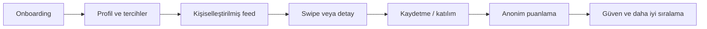
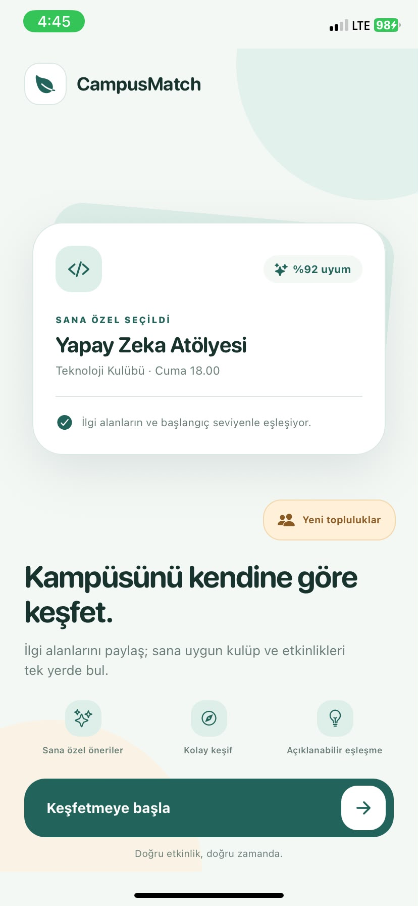
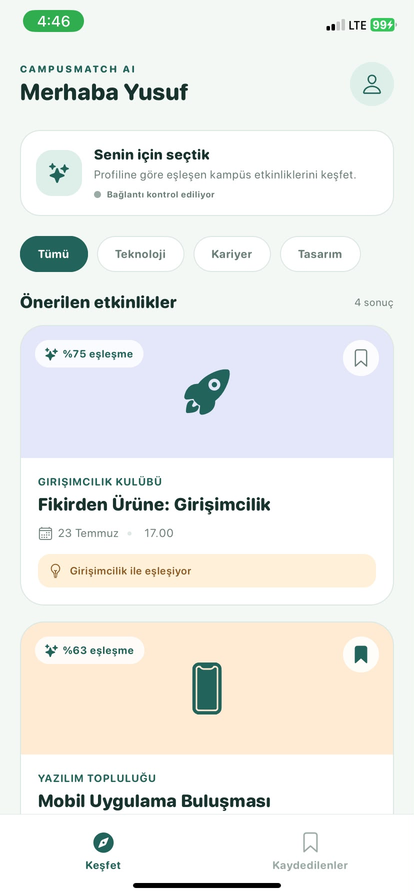
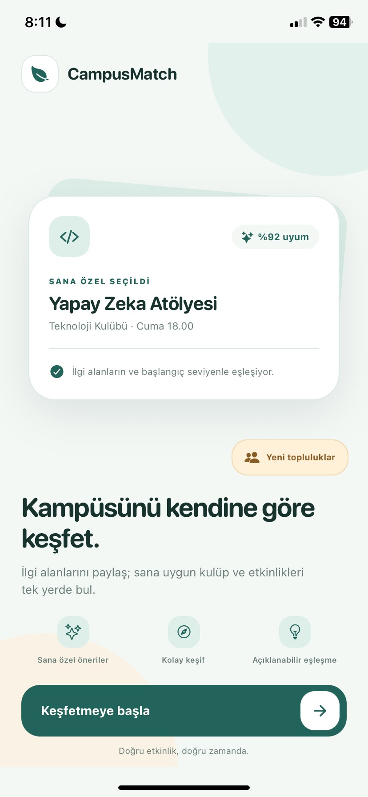
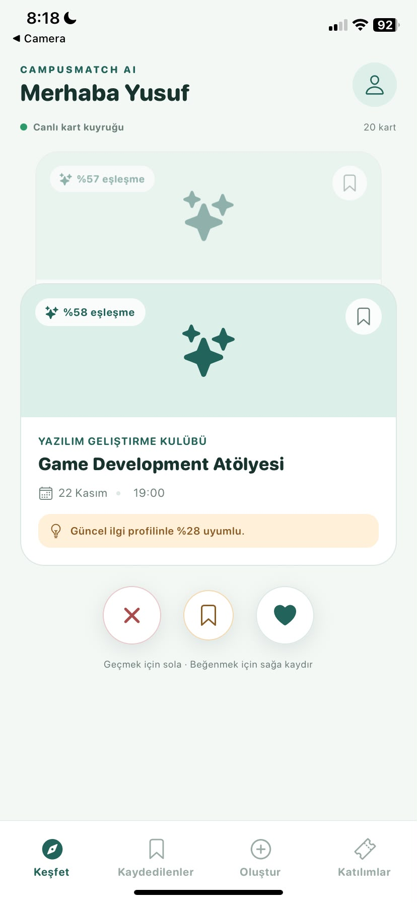
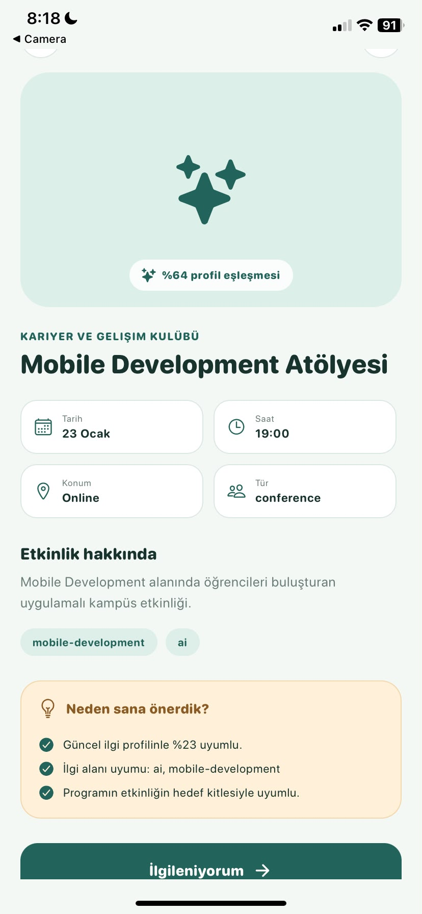
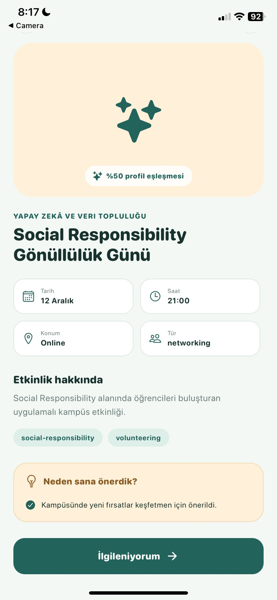

# YZTA Bootcamp 2026 Grup 132

> CampusMatch AI — doğru öğrenci, doğru kulüp ve doğru etkinlikle daha hızlı buluşsun.

`Mobil öncelikli` · `Açıklanabilir öneri sistemi` · `React Native / Expo` · `FastAPI`

## Ürün Bilgileri

### Takım Üyeleri

| İsim | Rol | Sorumluluk |
|---|---|---|
| Yusuf Öztop | Product Owner | Ürün vizyonu, kapsam ve backlog öncelikleri |
| Yusuf Göktepe | Scrum Master | Sprint takibi, ekip koordinasyonu ve süreç yönetimi |
| Betül Tuba Gümüş | Developer | Mobil uygulama ve ürün geliştirme |
| Gülşen Eymen Dediler | Developer | Mobil/backend entegrasyonu ve ürün geliştirme |
| Cemal Faruk Tuğrul | Developer | Backend, AI/veri ve ürün geliştirme |

> Sorumluluk açıklamaları repo içindeki iş sahipliği modeline göre özetlenmiştir; kesin kişi bazlı görev dağılımı takım tarafından güncellenebilir.

### Ürün Adı

**CampusMatch AI**

### Ürün Açıklaması

CampusMatch AI, üniversite öğrencilerinin ilgi alanları, bölümleri, hedefleri ve etkinlik tercihleri doğrultusunda kendilerine uygun kulüp ve etkinlikleri keşfetmesini sağlayan yapay zekâ destekli, mobil öncelikli bir platformdur. Dağınık etkinlik duyurularını tek deneyimde toplar ve öğrencinin keşif süresini kısaltır.

Ürün yalnızca bir eşleşme yüzdesi sunmaz; etkinliğin neden önerildiğini açıklayarak kullanıcı güvenini artırır. Öğrenci profili, davranış sinyalleri ve sentetik veriler açıklanabilir bir sıralama sisteminde birleştirilir.

### Temel Özellikler

- Kontrollü onboarding ve öğrenci profili oluşturma
- İlgi, bölüm, katılım amacı, biçim, ücret ve dil tercihlerine göre öneri
- Açıklanabilir eşleşme skoru ve “Neden önerildi?” bilgisi
- Kart kaydırmalı etkinlik keşfi, detay, beğenme, atlama ve kaydetme
- Çevrim dışı interaction kuyruğu ve bağlantı sonrası güvenli tekrar
- Mikro etkinlik oluşturma, katılım ve anonim organizatör puanlama
- Güven, moderasyon ve etkinlik yayınlama kuralları

### Hedef Kitle

- Türkiye'deki üniversite öğrencileri
- Üniversite kulüpleri ve öğrenci toplulukları
- Kampüs etkinliği düzenleyen öğrenci organizatörleri

### Proje Yönetimi Bağlantıları

| Kaynak | Bağlantı |
|---|---|
| GitHub Repository | [Group-132-YZTA-BOOTCAMP-2026](https://github.com/yusufgoktepe/Group-132-YZTA-BOOTCAMP-2026) |
| Product Backlog | [Repo içi backlog](./product/product_backlog.md) |
| GitHub Projects / Miro / Jira | `[Bağlantı eklenecek]` |
| Tasarım Dosyası | `[Figma bağlantısı eklenecek]` |
| Canlı Demo | `[Demo bağlantısı eklenecek veya sunulmadı olarak belirtilecek]` |
| 3 Dakikalık Proje Videosu | `[YouTube bağlantısı eklenecek]` |
| Sprint Belgeleri | [ProjectManagement](./ProjectManagement/README.md) |

## İhtiyaç ve Çözüm Eşleşmesi

| İhtiyaç | CampusMatch AI çözümü | Kullanıcı değeri |
|---|---|---|
| Duyurular farklı kanallarda kayboluyor. | Etkinlikleri tek kişiselleştirilmiş keşif akışında toplar. | Arama süresi azalır. |
| Genel listeler öğrencinin ilgisini yansıtmıyor. | Profil ve davranış sinyalleriyle sıralama yapar. | Daha ilgili etkinlikler öne çıkar. |
| Önerinin nedeni anlaşılmıyor. | Skor kırılımı ve kısa öneri nedenleri sunar. | Güven ve karar kalitesi artar. |
| Küçük öğrenci etkinlikleri görünür olamıyor. | Güven kurallı mikro etkinlik oluşturma sağlar. | Kampüs içi katılım ve erişim artar. |

## Kullanıcı Akışı


```mermaid
flowchart LR
    A[Onboarding] --> B[Profil ve tercihler]
    B --> C[Kişiselleştirilmiş feed]
    C --> D[Swipe veya detay]
    D --> E[Kaydetme / katılım]
    E --> F[Anonim puanlama]
    F --> G[Güven ve daha iyi sıralama]
```

## Teknik Mimari ve Yapay Zekâ

| Katman | Teknoloji / yaklaşım |
|---|---|
| Mobil | React Native, Expo, Expo Router, TypeScript |
| Backend | FastAPI, Uvicorn, Python |
| Veri | SQLite, CSV, JSON Schema ve sentetik veri |
| Öneri | Açıklanabilir kural/skor tabanı ve davranış sinyalleri |
| Deneysel ML | Temporal XGBoost karşılaştırması ve K-Means segmentasyon deneyi |
| Kalite | Pytest, TypeScript, Expo lint, sözleşme ve E2E kontrolleri |

### Doğrulanmış Son Ürün Kapsamı

| Gösterge | Son durum |
|---|---|
| Eğitim referansı | ÖSYM 2026-YKS kaynaklı 202 üniversite ve 14.281 aktif ön lisans/lisans programı |
| Etkinlik kataloğu | 56 geriye uyumlu etkinlik ile 250 Event V3 kaydından oluşan 306 etkinlik |
| V3 demo verisi | 80 organizatör, 1.200 katılım, 800 anonim puan ve 5.393 ilgi ağırlığı |
| Mobil kapsam | 6 rota; profil, swipe keşif, detay, kayıt, mikro etkinlik ve katılım/puanlama |
| Otomatik kalite | 74 backend/ML testi, TypeScript, Expo lint, mobil sözleşme ve web/iOS production export kontrolleri başarılı |

Resmî ÖSYM kimlikleri ile sentetik V3 kimlikleri backend eşleme katmanında uzlaştırılmıştır. Bu sayede kullanıcı resmî listeden üniversite ve program seçerken kişiselleştirilmiş V3 feed filtreleri çalışmaya devam eder. Kaynak ve üretim ayrıntıları: [Türkiye eğitim referansı](./data/reference/README.md).

Öneri motoru profil uyumu, dinamik ilgi, organizatör güveni, popülerlik ve kişisel davranış düzeltmesini ayrı bileşenlerde hesaplar. `like`, `skip`, `save`, `view_detail` ve `apply` sinyalleri ile kartta geçirilen süre, ilgi ağırlıklarını kontrollü biçimde günceller.

Temporal değerlendirmede test NDCG@10 değeri kural tabanında `0.7992`, XGBoost'ta `0.8032`, hibritte `0.8015` ölçüldü. XGBoost belirlenen göreli `%2` iyileştirme eşiğini aşmadığı için üretimde daha açıklanabilir kural tabanı korundu. Ayrıntı: [Ranking değerlendirmesi](./ml/ranking_evaluation_v3.md).

> Ürün, öneri ve makine öğrenmesi bileşenleri içerir. Repo içinde kullanıcıya sunulan bağımsız bir AI ajan, ajan hafızası veya çoklu ajan orkestrasyonu kanıtı bulunmadığından böyle bir özellik varmış gibi beyan edilmemiştir.

## Çalıştırma

### Backend

```powershell
cd <proje-klasörü>
.\.venv\Scripts\python.exe -m uvicorn backend.app.main:app --host 0.0.0.0 --port 8000
```

API sağlık kontrolü: `http://127.0.0.1:8000/health`

### Mobil uygulama ve Expo Go

```powershell
cd <proje-klasörü>\mobile
Copy-Item .env.example .env
npx.cmd expo start
```

Fiziksel telefon için bilgisayar ve telefon aynı Wi-Fi ağına bağlanır. `.env` içindeki `EXPO_PUBLIC_API_URL`, bilgisayarın yerel IP adresiyle (örneğin `http://192.168.x.x:8000`) ayarlanır. Telefonda Expo Go açılarak terminaldeki QR kod okutulur. Ayrıntılı yönergeler: [Expo kurulumu](./mobile/EXPO_SETUP.md).

---

# Sprint 1

## Sprint Notları

- Sprint hedefi: Ürün fikrini, hedef kitleyi, kullanıcı akışlarını, ekip modelini ve teknik yaklaşımı netleştirmek.
- Tahmini sprint puanı: `[Takım tarafından doğrulanacak]`
- Tamamlanan puan: `[Takım tarafından doğrulanacak]`
- Sprint tarihi: 19 Haziran – 5 Temmuz 2026

## Backlog Düzeni ve Story Seçimleri

Planlama ve temel oluşturma işleri önceliklendirildi. Ürün vizyonu, öğrenci/kulüp yöneticisi hikâyeleri, mobil-first akış, sentetik veri şeması, FastAPI iskeleti ve açıklanabilir recommendation baseline alt görevlere ayrıldı. [Sprint 1 planlama ayrıntıları](./ProjectManagement/Sprint1Documents/sprint-planning.md)

## Daily Scrum

Toplantılar takım uygunluğuna göre WhatsApp üzerinden yürütüldü ve üç kontrol noktasında repo notlarına aktarıldı.

[Daily Scrum Notları](./ProjectManagement/Sprint1Documents/daily-scrum-notes.md)

## Sprint Board Güncellemeleri

GitHub Projects bağlantısı ve Sprint 1 board ekran görüntüleri henüz eklenmemiştir. Beklenen dosyalar `sprint-1-backlog.png` ve `sprint-1-board.png` olarak belgelenmiştir.

[Sprint Board Güncellemeleri](./ProjectManagement/Sprint1Documents/sprint-board-updates.md)

## Ürün Durumu

Sprint 1, fikri yapılandırılmış MVP hazırlığına taşıdı. Gösterilebilir çıktılar ürün belgeleri, backlog, veri şeması, recommendation baseline ve backend health endpoint'idir. Bu sprinte ait ürün ekran görüntüsü bulunmadığından sahte veya bozuk görsel eklenmedi.

## Sprint Review

- Tamamlanan çalışmalar: Ürün vizyonu, hedef kitle, hikâyeler, akışlar, veri ve teknik temel.
- Tamamlanamayan işler ve nedenleri: Çalışan mobil MVP Sprint 2 kapsamına bırakıldı; board görselleri belgelenmedi.
- Alınan geri bildirimler: Öğrenci deneyimi ve açıklanabilir AI önceliklendirildi.
- Bir sonraki sprint'e aktarılan işler: Mobil MVP, API genişletme ve öneri entegrasyonu.
- Katılımcılar: Beş takım üyesi.

[Ayrıntılı Sprint Review](./ProjectManagement/Sprint1Documents/sprint-review.md)

## Sprint Retrospective

| İyi Gidenler | Geliştirilecek Noktalar | Aksiyonlar |
|---|---|---|
| Ortak ürün yönü netleşti. | Görev sahipliği ve board takibi güçlendirilmeli. | Her işe tek sorumlu ve düzenli kayıt atanacak. |
| Açıklanabilir AI yaklaşımı seçildi. | Belgeler sprint sonuna yığılmamalı. | Sprint içinde periyodik güncelleme yapılacak. |

[Ayrıntılı Retrospective](./ProjectManagement/Sprint1Documents/sprint-retrospective.md)

---

# Sprint 2

## Sprint Notları

- Sprint hedefi: Planlanan öğrenci deneyimini çalışan mobil MVP'ye dönüştürmek ve mobil, backend ile AI/veri katmanlarını bağlamak.
- Tahmini sprint puanı: `[Takım tarafından doğrulanacak]`
- Tamamlanan puan: `[Takım tarafından doğrulanacak]`
- Sprint tarihi: 6 – 18 Temmuz 2026

## Backlog Düzeni ve Story Seçimleri

Onboarding → profil → kişiselleştirilmiş keşif → detay → kaydetme yolu P0 olarak seçildi. Backend, mobil ve veri işleri ortak API sözleşmesine göre birleştirildi. Tam Türkiye üniversite-program referansı kısmi kaldı. [Sprint 2 planlama ayrıntıları](./ProjectManagement/Sprint2Documents/sprint-planning.md)

## Daily Scrum

Sprint 2 için tarih bazlı Daily Scrum kaydı mevcut arşivde bulunmamaktadır. Dosyada, takımın gerçek mesajlarını sonradan aktarabileceği şablon bırakılmıştır.

[Daily Scrum Notları](./ProjectManagement/Sprint2Documents/daily-scrum-notes.md)

## Sprint Board Güncellemeleri

Backlog durumu metinsel olarak doğrulanmıştır; `sprint-2-backlog.png` ve `sprint-2-board.png` henüz eklenmemiştir.

[Sprint Board Güncellemeleri](./ProjectManagement/Sprint2Documents/sprint-board-updates.md)

## Ürün Durumu


*Kısa açıklama: CampusMatch AI öğrenci onboarding ekranı.*


*Kısa açıklama: Profil tercihlerine göre sıralanan etkinlik keşif ekranı.*

Diğer dört gerçek ekran [Sprint 2 belge dizininde](./ProjectManagement/Sprint2Documents/README.md) listelenmiştir.

## Sprint Review

- Tamamlanan çalışmalar: Expo MVP, Profil V2, keşif/detay/kaydetme, API ve V2 sentetik veri.
- Tamamlanamayan işler ve nedenleri: Tam resmî üniversite-program referansı veri kaynağı eksikliği nedeniyle kısmi kaldı.
- Alınan geri bildirimler: Veri sözleşmeleri erken sabitlenmeli; canlı/yerel öneri kaynağı görünür olmalı.
- Bir sonraki sprint'e aktarılan işler: Kalıcı veri, swipe, mikro etkinlik, güven ve final testleri.
- Katılımcılar: `[Takım tarafından doğrulanacak]`

[Ayrıntılı Sprint Review](./ProjectManagement/Sprint2Documents/sprint-review.md)

## Sprint Retrospective

| İyi Gidenler | Geliştirilecek Noktalar | Aksiyonlar |
|---|---|---|
| Mobil MVP fiziksel telefonda çalıştı. | Veri sözleşmeleri süreçte değişti. | Profil ve ML sözleşmeleri ayrıldı. |
| Backend/veri entegrasyonu tamamlandı. | Kategori ve referans kapsamı dardı. | V2 dataset genişletildi. |

[Ayrıntılı Retrospective](./ProjectManagement/Sprint2Documents/sprint-retrospective.md)

---

# Sprint 3

## Sprint Notları

- Sprint hedefi: Faz 0–8 kapsamında kalıcı veri, feed, swipe, davranış öğrenmesi, mikro etkinlik, güven ve final kalite akışlarını tamamlamak.
- Tahmini sprint puanı: `[Takım tarafından doğrulanacak]`
- Tamamlanan puan: `[Takım tarafından doğrulanacak]`
- Sprint tarihi: 1 Ağustos 2026 – `[Bitiş tarihi takım tarafından doğrulanacak]`

## Backlog Düzeni ve Story Seçimleri

PB-01–PB-28 işleri teknik bağımlılıklarına göre dokuz faza ayrıldı. Ürün kararları ve veri sözleşmeleri tamamlandıktan sonra feed, mobil swipe, dinamik ilgi, mikro etkinlik, güven/moderasyon ve ölçümlü ML değerlendirmesi geliştirildi. [Sprint 3 planlama ayrıntıları](./ProjectManagement/Sprint3Documents/sprint-planning.md)

## Daily Scrum

İlerleme Faz 0–1, 2–3, 4–5, 6–7 ve 8 kontrol noktalarında özetlendi. Açık dış bağımlılık fiziksel cihaz kabulüdür.

[Daily Scrum Notları](./ProjectManagement/Sprint3Documents/daily-scrum-notes.md)

## Sprint Board Güncellemeleri

PB-01–PB-27 tamamlandı; PB-28 fiziksel iPhone kabulünü bekliyor. Güncel ürün ekranları eklendi; GitHub Projects bağlantısı ve board ekran görüntüleri henüz eklenmemiştir.

[Sprint Board Güncellemeleri](./ProjectManagement/Sprint3Documents/sprint-board-updates.md)

## Ürün Durumu

Ana öğrenci akışı profil oluşturmadan kişiselleştirilmiş feed'e, kaydetmeye, mikro etkinlik katılımına ve anonim puanlamaya kadar backend ile kalıcı çalışır durumdadır. Resmî eğitim referansı V3 öneri kimlikleriyle, eski etkinlik kataloğu ise yeni interaction kimlikleriyle uyumlu hâle getirilmiştir. Profil, kaydedilen etkinlikler ve başarısız interaction istekleri cihazda korunur; canlı API yanıt vermediğinde uygulama beş saniye içinde yerel açıklanabilir kartlara geçer.

| Final onboarding | Swipe ile kişiselleştirilmiş keşif |
|---|---|
|  |  |
| **Etkinlik detayı ve profil eşleşmesi** | **Açıklanabilir öneri detayı** |
|  |  |

## Sprint Review

- Tamamlanan çalışmalar: V3 veri, feed, swipe, offline kuyruk, dinamik ranking, mikro etkinlik, güven ve otomatik kalite.
- Tamamlanamayan işler ve nedenleri: Fiziksel cihaz/VoiceOver kabulü dış ortam doğrulaması gerektiriyor.
- Alınan geri bildirimler: Model değişikliği ölçülebilir kalite eşiğine bağlandı.
- Bir sonraki sprint'e aktarılan işler: Yeni geliştirme fazı yok; teslim ve insan kabulü kapatılacak.
- Katılımcılar: `[Takım tarafından doğrulanacak]`

[Ayrıntılı Sprint Review](./ProjectManagement/Sprint3Documents/sprint-review.md)

## Sprint Retrospective

| İyi Gidenler | Geliştirilecek Noktalar | Aksiyonlar |
|---|---|---|
| Fazlar sözleşme ve testlerle kapatıldı. | Fiziksel cihaz testi CI içinde değil. | Final insan kabul listesi uygulanacak. |
| Production ranking ölçümle korundu. | Gerçek timestamp verisi bulunmuyor. | Gerçek veride promotion eşiği yeniden ölçülecek. |

[Ayrıntılı Retrospective](./ProjectManagement/Sprint3Documents/sprint-retrospective.md)

---

# Proje Sonucu

## Genel Değerlendirme

CampusMatch AI, öğrenci profilini kişiselleştirilmiş ve açıklanabilir etkinlik keşfine bağlayan çalışan bir mobil MVP düzeyine ulaşmıştır. Mobil uygulama, FastAPI backend, kalıcı veri, interaction kaydı, mikro etkinlik ve güven döngüsü tek ürün akışında birleşmektedir. Sentetik veriler gerçek kullanıcı mahremiyetini riske atmadan öneri yaklaşımını geliştirmeyi ve ölçmeyi mümkün kılmıştır.

Ürün; ihtiyaç–çözüm uyumu, öğrenci odaklı kullanıcı deneyimi, kampüs toplulukları için pazar potansiyeli ve açıklanabilir AI yaklaşımıyla değerlendirme kriterlerine doğrudan karşılık verir. Bununla birlikte public repo, fiziksel telefon kabulü, board görselleri ve YouTube videosu teslimden önce ayrıca kapatılmalıdır.

## Değerlendirme Kriterleri ve Kanıtlar

| Kriter | Repo kanıtı | Durum |
|---|---|---|
| Yarışmaya hazır, çalışan proje | Expo mobil, FastAPI, web/iOS export ve E2E testleri | Otomatik kontroller tamam; fiziksel kabul açık |
| Özgünlük | Açıklanabilir kampüs etkinliği eşleştirme ve mikro etkinlik güven döngüsü | Mevcut |
| Ürün tamamlanma / bütünlük | Profil → feed → interaction → katılım → rating | Ana akış mevcut |
| İhtiyaç ve çözüm eşleşmesi | Problem/çözüm tablosu ve ürün akışı | Belgeli |
| Kullanıcı değeri ve deneyimi | Mobil-first onboarding, swipe, neden açıklaması, offline kuyruk | Mevcut |
| Pazar potansiyeli | Öğrenci, kulüp ve mikro organizatör olmak üzere iki taraflı yapı | Hipotez; gerçek kullanıcı doğrulaması gerekli |
| Fonksiyonel yeterlilik | API'ler, 6 mobil rota ve 74 testlik son kayıt | Mevcut |
| Yapay zekâ modeli | Skor tabanı, XGBoost karşılaştırması, K-Means deneyi | Belgeli |
| AI ajanları / hafıza / orkestrasyon | Üründe bu özellik için doğrulanmış kanıt yok | Talep edilmemiş / beyan edilmedi |
| Mimari ve temiz kod | `mobile/`, `backend/`, `ml/`, `data/` katmanları ve sözleşmeler | Mevcut |
| Canlıya alınabilirlik | Expo Go LAN kurulumu ile web ve iOS production export | Canlı URL yok; cihaz kabulü açık |

## Gelecek Geliştirmeler

- ÖSYM üniversite ve program referansını her yeni kılavuz döneminde yeniden üretmek
- Authentication ve üniversite doğrulaması eklemek
- Gerçek kullanıcı verisiyle öneri kalitesini ve pazar varsayımlarını ölçmek
- Native tarih seçici, erişilebilirlik ve fiziksel cihaz kabulünü tamamlamak
- PostgreSQL ve production deployment altyapısına geçmek

## Son Teslim Kontrolü

- [ ] GitHub reposu public olarak doğrulandı
- [x] Üç sprint için ilerleme ve kanıt belgeleri repoya eklendi
- [x] Güncel final ürün ekran görüntüleri eklendi
- [ ] Eksik sprint board ekran görüntüleri eklendi
- [ ] GitHub Projects/Miro/Jira bağlantısı eklendi
- [ ] Fiziksel cihaz kabul listesi tamamlandı
- [ ] Canlı demo bağlantısı eklendi veya sunulmadığı belirtildi
- [ ] Üç dakikalık proje videosu YouTube'a yüklendi
- [ ] Teslim formu eksiksiz dolduruldu
- [ ] Tüm teslimler 2 Ağustos 2026 saat 23.59'dan önce tamamlandı

Ayrıntılı kontrol: [Final kabul kontrol listesi](./ProjectManagement/Sprint3Documents/final-acceptance-checklist.md)

## Repo Yapısı

```text
.
├── README.md
├── ProjectManagement/
│   ├── Sprint1Documents/
│   ├── Sprint2Documents/
│   └── Sprint3Documents/
├── backend/
├── mobile/
├── ml/
├── data/
├── product/
├── scrum/
└── assets/
```

Eski `product/`, `scrum/` ve `assets/` kayıtları geçmişi korumak için silinmemiştir. `ProjectManagement/` teslim odaklı düzenli görünüm, kök README ise ana rapor ve sunum sayfasıdır.
